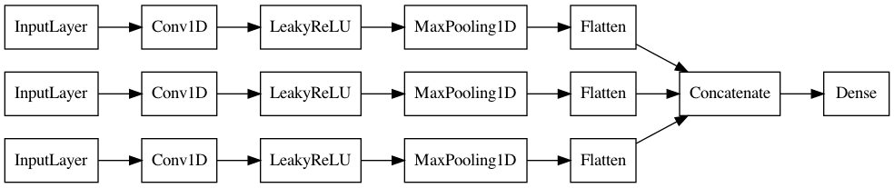

# Pipeline

All adjustable parameters for each step of the pipeline are to be specified in `steps/config.py`. 

Detailed documentation for these parameters can be found in docstring at the top of the python files. Default parameters are those used when preparing the assignment submission.

---

## Step 0. Setup environment
Create a virtual environment and install required packages:
````
python3 -m venv venv
pip -r requirements.txt
````
Activate the virtual environment:
````
source venv/bin/activate
````
Specify model parameters as desired in `steps/config.py`

## Step 1. Prepare data
````
python steps/1_prepare_data.py
````
In this step, source data is transformed from the source parquet files into a custom `ShopperData` format which can be quickly read from the disc row-by-row to decrease memory usage and speed up the training process. Input matrices required for the CNN model are built on-the-fly when streaming the data.

Please note that preparing data can take a very long time due to the size of the data. It is therefore suggested to set `LIMIT_SHOPPERS_DATA_PREP` and `LIMIT_SHOPPERS_TRAINING` to the same value.

## Step 2. Train the CNN model
````
python steps/2_train_model.py
````
In this step, the CNN model is built and trained as presented in the paper. 

### Model architecture:



__Inputs__:
* `H` = recent purchase history of a shopper (250x5; 5 most recent days)
* `F` = extended purchase history (250x5; each column is a purchase frequency for five days s.t. 25 preceding days are considered)
* `C` = coupon history (250x6; 5 most recent days plus the coupons in the prediction week)

__Target__:
* `P` = actual purchases in the prediction week

### Naive benchmark (random predictions):
````
python steps/2_train_model.py --naive
````

## Step 3. Assign coupons
````
python steps/3_assign_coupons.py
````
In this step, randomized and optimized coupons are assigned for the week 90 using the trained model from step 2 to predict the purchase probabilities.

As expected, randomly assigned coupons lead to a decrease in revenue (cp. to no assigned coupons), whereas optimally assigned coupons lead to a significant revenue uplift.
